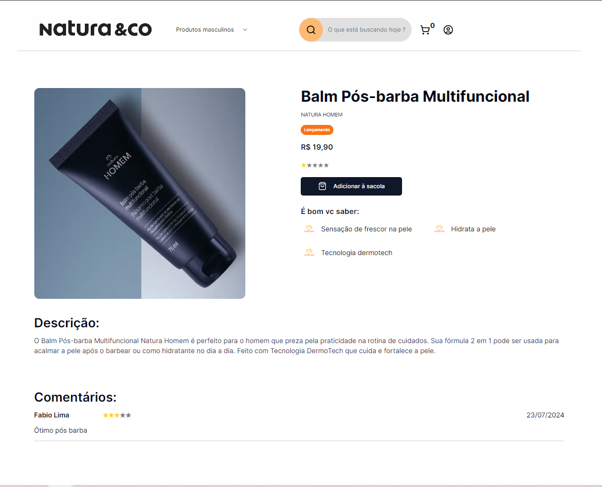
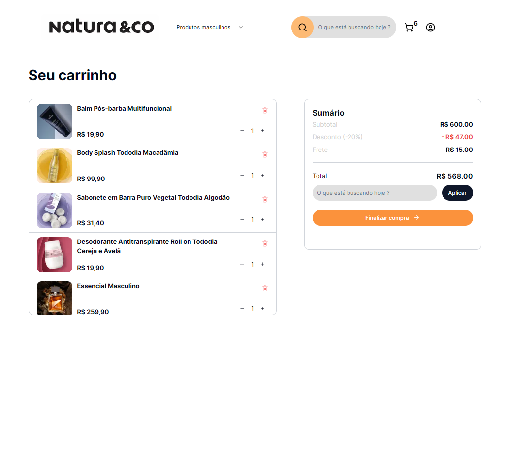
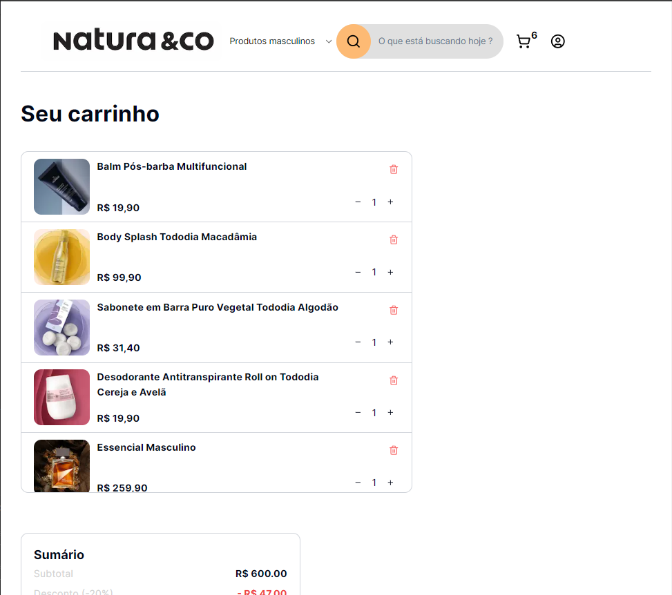

# Natura E-commerce Clone


Este projeto é um clone do site de e-commerce da Natura, desenvolvido em 4 dias. O objetivo é listar produtos, permitir filtragem por categorias (Masculino, Feminino, Infantil) e busca por texto, visualizar detalhes do produto, adicionar produtos ao carrinho e finalizar a compra. O design e algumas informações são inspirados no site oficial da Natura.

## Funcionalidades

- **Listagem de Produtos**: Navegue por uma variedade de produtos com opções de filtragem por categoria e busca por nome do produto.
- **Detalhes do Produto**: Veja informações detalhadas sobre um produto, incluindo nome, marca, preço, avaliações e informações adicionais.
- **Adicionar ao Carrinho**: Adicione produtos ao carrinho e veja a contagem de itens no carrinho atualizar em tempo real.
- **Carrinho de Compras**: Visualize todos os produtos adicionados ao carrinho, com o preço total calculado com base nas quantidades dos produtos.
- **Finalizar Compra**: Complete a compra enviando os itens do carrinho para o backend, que então limpa o carrinho e redireciona para a página inicial.
- **Design Responsivo**: Todas as páginas são responsivas e otimizadas para vários dispositivos.

## Tecnologias Utilizadas

- **React**: Biblioteca para criar interfaces de usuário.
- **Next.js**: Framework para aplicações React com renderização do lado do servidor.
- **TypeScript**: Superset de JavaScript para adicionar tipagem estática.
- **JavaScript**: Linguagem de programação para lógica do frontend.
- **Tailwind CSS**: Framework CSS para estilização responsiva e modular.
- **Shadcn**: Componentes UI para React.
- **Lucide React**: Biblioteca de ícones para React.
- **Swiper**: Biblioteca de sliders/carrosséis.
- **Zod**: Biblioteca de validação de esquemas.
- **Cloudflare**: Para hospedagem das imagens dos produtos.
- **Axios**: Cliente HTTP para fazer requisições ao backend.

## Páginas

### Home (Desk / Tablet)


### Listagem de Produtos Filtrados (Desk / Tablet)


### Detalhes do Produto (Desk / Tablet)



### Carrinho (Desk / Tablet)



## Configuração do Projeto

1. Clone o repositório:
    ```bash
    git clone https://github.com/seuusuario/natura-ecommerce-clone.git
    ```

2. Instale as dependências do frontend:
    ```bash
    cd frontend
    npm install
    ```

3. Instale as dependências do backend:
    ```bash
    cd backend
    npm install
    ```

4. Configure o banco de dados:
    ```bash
    npx prisma migrate deploy
    ```

5. Inicie o servidor de desenvolvimento do frontend:
    ```bash
    npm run dev
    ```

6. Inicie o servidor de desenvolvimento do backend:
    ```bash
    npm run start:dev
    ```

## Uso

- **Navegar pelos Produtos**: Navegue até a página inicial para ver os produtos. Use os filtros de categoria e a barra de busca para encontrar produtos específicos.
- **Ver Detalhes do Produto**: Clique em um produto para ver suas informações detalhadas.
- **Adicionar ao Carrinho**: Clique no botão "Adicionar ao Carrinho" na página de detalhes do produto para adicioná-lo ao carrinho.
- **Visualizar Carrinho**: Clique no ícone do carrinho no cabeçalho para ver os produtos no seu carrinho.
- **Finalizar Compra**: Clique no botão "Finalizar compra" no carrinho para completar a compra. Isso enviará os itens do carrinho para o backend e limpará o carrinho.
